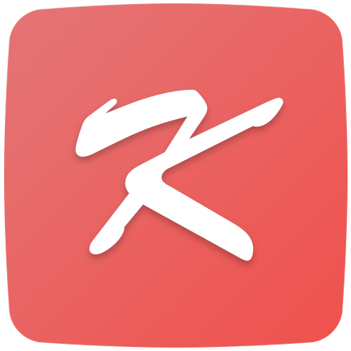

# 강고 포켓

>   속 강원고등학교, 강고 포켓
    
- [Google Play](https://play.google.com/store/apps/details?id=com.RiDsoft.kangwonhighschool)
- [강고 포켓 웹](http://kanggo.xyz)

## 소개

강고 포켓은 여러 강원고등학교 학생들에게 힘이 되어 주었습니다.

복잡한 학교, 복잡한 시스템, 복잡한 구조.

이 환경을 타개할 제가 찾은 해결책은 "모바일 애플리케이션" 이었습니다.

학생들의 스마트폰 사용을 기존의 틀 안에서 고정된 시각으로만 바라보는 분들도 있었습니다.

주머니강고 포켓으로 하여금 그 분들의 틀을 깨는 것, 그리고 가능성.

이것은 제가 이루고자 하는 목적이며, 성취해 나가고 있는 목표입니다.

강고 포켓은 강원고등학교 학생들을 위한 애플리케이션입니다. 

## 기능

1. 시간표
    > 시간표 기능은 강고 포켓의 가장 중요하면서도 주요한 기능입니다.
    > 단순히 시간표 메뉴의 '시간표 업데이트' 버튼을 누르면, 강고 포켓은 서버에서 자동으로 시간표를 다운로드할 것입니다.

2. 급식 정보
    > 급식 정보는 학교에서 나이스에 제공하는 데이터를 기반으로 합니다.
    > 강고 포켓의 급식 메뉴에 들어가면 상단에 '급식 업데이트' 버튼과 ' '알러지 정보' 버튼을 찾을 수 있습니다. 
    >
    > 강고 포켓이 다른 앱과 다른 점은 여기에 있습니다.
    > 바로 한번 급식 정보를 업데이트 하게 되면 그 날의 급식 정보만 저장하는 것이 아니라, 그 주의 급식 데이터를 모두 저장한다는 것입니다.
    >
    > 또한 강고 포켓을 이용하는 주 사용자는 학생들이기 때문에, 자주 확인하는 급식 메뉴를 저장하여 데이터 소모를 아낄 수 있도록 했습니다.
    >
    > (급식 파싱 라이브러리: <https://bitbucket.org/whdghks913/wondanghighschool>)

3. 학교 웹 뷰어
    > 기존에는 수업시간에 필요한 자료를 검색하거나, 학교 제출 양식 등을 다운로드하기 위해서는 학교 홈페이지에 접속해야 했습니다.
    > 강고 포켓의 학교 웹 뷰어 기능은 학교 홈페이지에 접속할 필요 없이도 필요한 자료를 검색/ 다운로드할 수 있습니다.

4. 공지사항
    > 강원고등학교 선생님과 학생 관리자들이 직접 운영하는 공지사항을 실시간으로 받아볼 수 있습니다.

5. 기타 기능
    > 이 외에도 교실 배치도, 생활 일과표, 학교 정보 등 유용한 정보를 제공하는 기능도 탑재되어 있습니다.
    > 메인 화면에서 좌측 가장자리에서 우측으로 밀면 간단 메모 기능이 나타납니다. 메모를 작성할 수도 있지만, 그 메모를 알림창에 고정시킬 수도 있습니다.

## 구현 내용
(작성중)

## 오픈소스 라이센스
[오픈소스 라이센스](/LICENSE.md)

## 스크린샷
(작성중)

